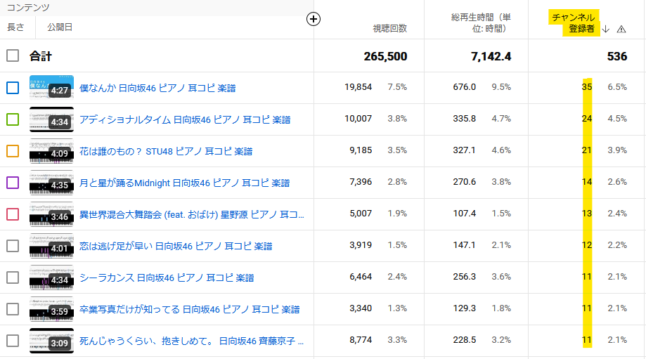
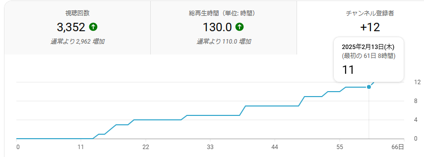

# 2025-02-13

今回の表題、今までと明らかに注目度が違うなと感じています。  

YouTube Studioでは、チャンネル登録のきっかけとなった動画を数値で確認することができます。  
私のチャンネルでは、通常1つの動画につき10人以上の登録をいただくと上位にランクインする状況です。  

興味深いことに、リリースからまだ日の浅い「卒業写真だけが知っている」が、既に上位入りを果たしているんです。  

比較のため、同じ表題の「月と星が踊るMidnight」のデータを見てみると、146日かけてようやく11人の登録だったのに対し、  

「卒業写真だけが知ってる」は、わずか61日で11人を達成しています（これを書いている間にも1人増えました）。  

このような反響の違いが生まれている理由について、とても興味深く感じています。  