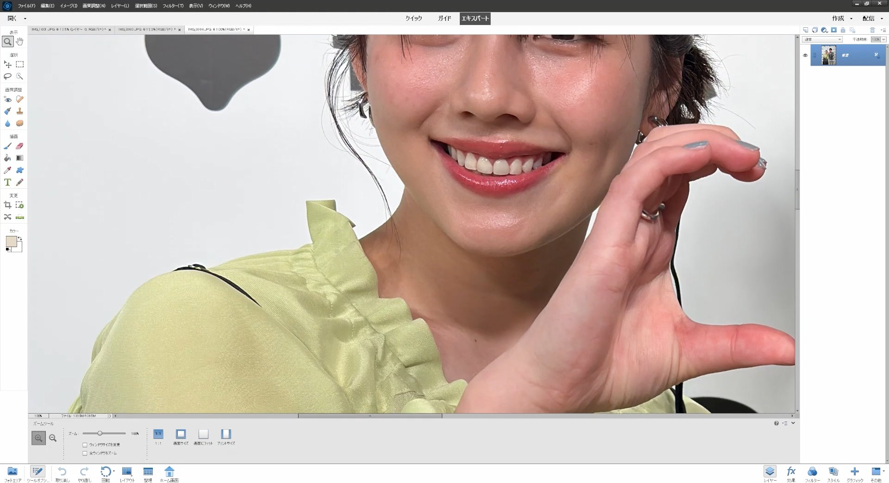

# 2025-03-30

## 渡邉美穂カレンダー発売記念イベントログ

SHIBUYA TSUTAYA 6階に到着すると、既にグッズを身に纏っている仲間の姿がちらほら。エレベーター横の非常階段前ではスタッフが整理番号B-540番台までの案内を開始。手元の電子チケットを確認すると次には呼ばれそう。17時20分過ぎ、B-550番までの呼び出しがかかり、緊張の足取りで非常階段口へ。

### 入場までの流れ
- 非常階段で電子チケット提示 → 謎のスタンプ押印(QRスキャンだとおもったら違った)
- 黄色い整理券を受け取り
- 階段途中に看板を発見(思わず遠近ショット撮影)
  
  
- 8階入口の列に合流(上を見上げるまで撮影に夢中で気付かなかった)

### 入場
列に並んで間もなく、スタッフから注意事項が。「スマホ等の操作は2ショット撮影直前まで禁止」
そして同時に奥から聞こえるテンション高めのみほちーの声。
ドキドキしながらも、Apple WatchとiPhoneをDREAMバッグへ(スマートウォッチは鞄の中にしまうように案内があった)。

### 荷物預け
長テーブルに置かれた買い物カゴ。
空いたカゴに荷物を預けるシステム。(iPhoneは鞄にしまう必要がなかった。慌ててiPhoneをバッグから救出)
最終待機列でちらりと見えはじめる。

### 2ショットタイム
黄色い整理券とiPhoneを手渡し、養生テープで囲まれた撮影エリアへ。事前の注意事項通りポーズ指定はせず、片思いハートを狙ってポーズをとると、予想外の両思いハートが返ってきてテンション上げ。

### 手渡しタイム
手渡しされるカレンダーも、目の前の本人もどちらも可愛くて困っちゃう。
最後に「秘密倶楽部またやってください」と伝え、スタッフさんから残りの2冊を受け取り、名残惜しく会場を後に。

### その後
SHIBUYA TSUTAYA を出た後、Xで「シブツタにおかえりなさい!」ボードの存在を知り再突入。地下2階で徘徊すること数分、奥の方にひっそりと佇むボードを発見。シャッター音を何度も響かせ、またSHIBUYA TSUTAYAを出た。

## 最後に
WQHDモニターにピクセル等倍で表示すると、こんな感じ。えぐい。
